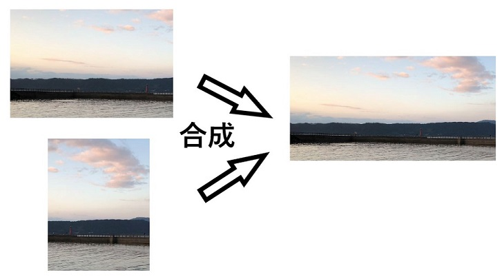
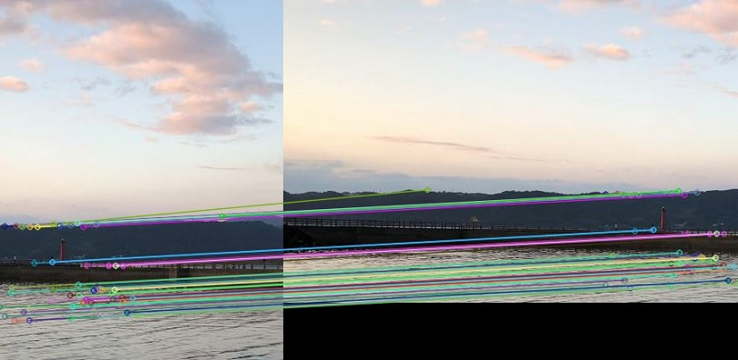

# Image-stitching-demo
複数枚の画像の合成（パノラマ画像生成）

## タスク説明
部分的に一致した複数枚の画像を合成して１枚の合成画像を生成<br>
パノラマ画像の生成によってロボティクス界隈でも利用される

</img>

図1：パノラマ画像生成

</img>

図2：画像間のマッチング

## 仮想環境
```
conda env create --file env.yaml
```

## 実装
[複数の画像からパノラマを作成 (OpenCV、Python)](https://www.qoosky.io/techs/dea950ec9a)を大いに参考
```
main(): SIFT特徴を用いたパノラマ生成(stitchingモジュールを使用しない場合)
main2(): stitchingモジュールを使用した場合
```

## 仮想環境
- python:3.8.13
- opencv:4.5.5
- numpy:1.23.0

## 参考サイト
- [複数の画像からパノラマを作成 (OpenCV、Python)](https://www.qoosky.io/techs/dea950ec9a)
- [SIFT (Scale-Invariant Feature Transform)の導入](http://labs.eecs.tottori-u.ac.jp/sd/Member/oyamada/OpenCV/html/py_tutorials/py_feature2d/py_sift_intro/py_sift_intro.html)
- [OpenCVのSIFTで特徴抽出してみた](https://qiita.com/tatsuya11bbs/items/225634d352de09206a8f)
- [OpenCV – 特徴点マッチングを行う方法について](https://pystyle.info/opencv-feature-matching/)
- [特徴点のマッチング](http://labs.eecs.tottori-u.ac.jp/sd/Member/oyamada/OpenCV/html/py_tutorials/py_feature2d/py_matcher/py_matcher.html)
- [OpenCV drawMatches出现报错Error: Assertion failed](https://blog.csdn.net/Owen_Suen/article/details/105077923)
- [anacondaでyamlファイルから仮想環境が作れない場合の対処法](https://qiita.com/hayato1130/items/676894f7e7dd0e9fe527)